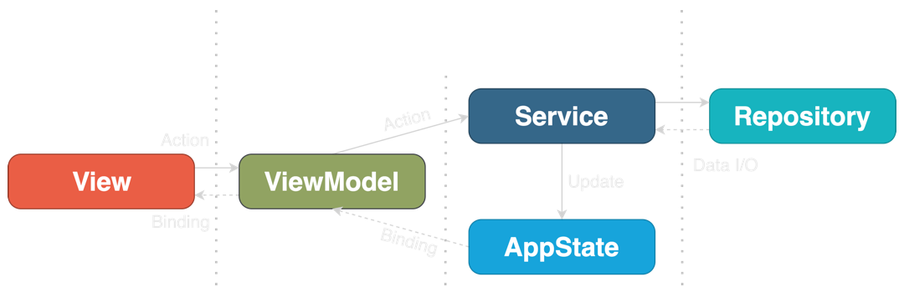

# DEV details

## MVVM

`ViewModel`: an `ObservableObject` that encapsulates the business logic and allows the `View` to observe changes of the state.

When the `View` appears on the screen, the `onAppear` callback calls `loadCountries()` on the `ViewModel`, triggering the networking call for loading the data inside WebService. `ViewModel` receives the data in the callback and pushes the updates through `@Published` variable countries, observed by the `View`.



Each view should have its own `ViewModel`. But there is no need to model the entire hierarchy. Only what the view needs.

+ The Model-oriented View Model (MVM), while low in code duplication, is a nightmare to maintain.
+ The View-oriented View Model (VVM) produces highly-specialised classes for each view, but contains duplicates.

Having one VM per View is easier to maintain and code for.

## NavigationList

`NavigationList` in the sub-board is a bad component. The _only_ way to make it work is to use `List` and `ForEach` together. You could use just `List` to iterate, but there is no way to use drag-n-drop, as it breaks UI behavior. When used together, you get the `onMove()` on `ForEach` that is the only way to use drag-n-drop.

## Themes

This is not working:

```swift
.environment(\.colorScheme, appThemeSetting.appTheme(colorScheme))
```

Sheets, for example, are not getting themed.


## Don't use `Form`.

`Form` changes elements behavior and look. Example: the placeholder for a `TextField`.

