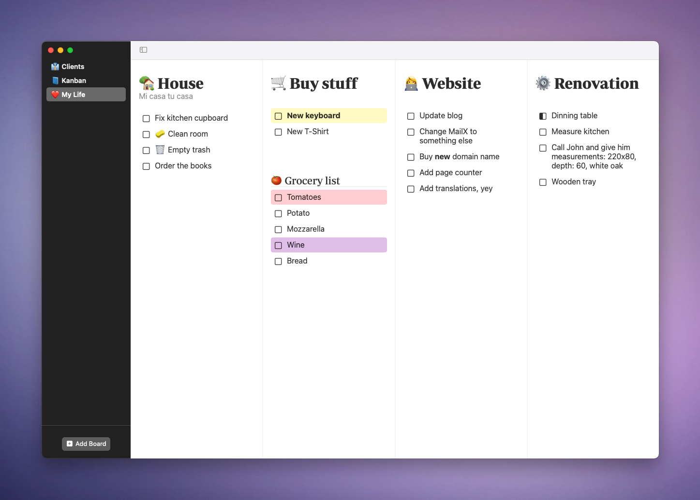

<h1 align="center">Clmn</h1>
<h3 align="center">Tasks in Columns</h3>

	

Beautiful macOS app that operates with tasks in columns.

Features:

+ Any number of columns
+ Group tasks
+ Mark tasks as in progress (2 states)
+ Drag-n-drop enabled
+ Markdown supported

# A friendly note ❤️

Clmn is a **paid "source-available"** app. That means I'm selling the pre-built version of the app. It takes time and effort to develop, distribute, maintain, and provide supports. If you like the app, please consider buying (one-time purchase). That would help me a lot! Thank you very much! 🙏

## Multiple clients

## Kanban board

## Just a bunch of tasks

